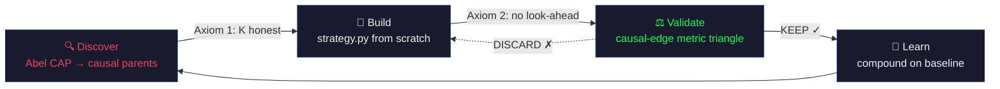

# causal-alpha

**Your agent discovers what drives any asset. Then it researches 600 experiments overnight. You wake up to honest results.**

```
Student:  "research alpha for SOL"
Agent:    [gets Abel key: 1 click] → [discovers 12 causal parents]
          → [fetches 5 years of prices] → [writes first strategy]
          → [runs 50 experiments with anti-gaming validation]
Agent:    "Found Sharpe 1.8 from causal parents. 3 KEEPs from 50 experiments.
           Or: No signal found after 50 experiments. Honest."
```

**5 minutes to first signal. 1 hour to honest results. Zero quant knowledge required.**



The agent is the quant. The student is the client. causal-alpha is the methodology that makes it honest.

## What This Is

A **skill** (not a library) that teaches AI agents to:

1. **Discover** what causally drives any asset — via [Abel CAP](https://cap.abel.ai/docs/getting-started/), the causal graph over 11,000+ financial nodes
2. **Research** autonomously — 600 experiments overnight, each validated against an anti-gaming metric triangle
3. **Report honestly** — "found alpha" or "no signal" — never fake results

Built on two axioms from mathematics (not opinions):

> **Axiom 1:** Causal search space (K≈10) is honest. Blind scan (K≈10,000) is not. Same Sharpe 1.8 → 97% real (causal) vs 41% real (blind). *— Pearl + Deflated Sharpe Ratio*

```
Pearl's definition:  causation = invariant under intervention
Market reality:      regime change = intervention
Consequence:         only causal signals survive live trading
Bonus:               causal K is small → DSR is honest → discoveries are real
```

> **Axiom 2:** Future data in features = invalid backtest. Zero tolerance. *— Definitional*

And three constraints from 200+ experiments across 6 assets (strong, but questionable with evidence):

> **C1:** Three orthogonal metrics > one metric *(currently Lo × IC × Omega via [causal-edge](https://github.com/cauchyturing/causal-edge))*
> **C2:** Serial compounding > pre-defined grid *(each improvement builds on the last)*
> **C3:** Explore = new information, not parameter tweaks *(100 fake explores → 0 keeps)*

Axioms are permanent. Constraints are our current best. The agent knows the difference.

## The 100× Equalizer

A college student with zero quant knowledge gets:

| What | Without causal-alpha | With causal-alpha |
|------|---------------------|-------------------|
| Discovery | Google "what predicts SOL?" (noise) | Abel CAP → 12 causal parents (K=10) |
| Strategy | Copy Reddit backtest (look-ahead) | Agent writes from scratch, zero look-ahead |
| Validation | "Sharpe is 3!" (gamed) | Metric triangle catches every gaming trick |
| Research | Manual, 1/day, gives up | 600/night, autonomous, compounds |
| Honest failure | Trades noise, loses money | "No signal found" → money saved |

**The student is protected from gaming, look-ahead, and false hope — without knowing what those words mean.**

## How It Works

```
causal-alpha (this skill — methodology)          causal-edge (framework — validation)
────────────────────────────────────────          ──────────────────────────────────
discover:  Abel CAP → causal parents              validate_strategy(csv) → PASS/FAIL
research:  experiment loop × metric triangle       15-test report card
report:    results.tsv + memory.md                 dashboard generation

        strategy.py — the ONE shared interface
        run_strategy(data) → (pnl, dates, positions)
```

**Point your agent at [`SKILL.md`](SKILL.md).** It gains full discovery + research capability in one read. References for depth. [causal-edge](https://github.com/cauchyturing/causal-edge) for validation.

## Quick Start

### For agents (the intended use)

```
Agent reads SKILL.md → full capability acquired
User says "research SOL" → agent handles everything:
  Abel key (1 click) → parents → prices → harness → experiments → results
```

### For direct use

```bash
# 1. Install validation framework
pip install git+https://github.com/cauchyturing/causal-edge.git

# 2. Get Abel API key
#    Visit https://abel.ai/skill or let the agent handle OAuth

# 3. Point your agent at this skill
#    Claude Code: copy to ~/.claude/agents/skills/causal-alpha/
#    Other agents: read SKILL.md into context
```

## Production Proof

Built from this methodology. Real paper trading, real data, real validation:

| Asset | Sharpe | Backtest | Research | Method |
|-------|--------|----------|----------|--------|
| ETH | 4.27 | 1,403 days | — | 1 Abel parent (SSTK), dual-lag xcorr |
| BNB | 2.82 | 1,537 days | 158 experiments | 18 parents (multihop + 8 crypto peers) |
| META | 2.57 | 1,060 days | 55 experiments | 25 Abel parents, multi-horizon GBDT |
| AAPL | 1.69 | 1,223 days | 40 experiments | Abel multihop + sector peers |
| TON | 1.77 | 2,043 days | — | 8-component vote ensemble |

**"Sharpe 4.27 — isn't that too good?"** Every number passed DSR (deflated for K), CPCV (PBO < 10%), rolling Sharpe stability, source substitution, and 11 other tests. The [validation framework is open source](https://github.com/cauchyturing/causal-edge) — run it yourself. If you can break these numbers, open an issue.

## Skill Architecture

```
causal-alpha/
  SKILL.md                     ← Start here. Full capability in one read.
  references/
    methodology.md             ← Why causal works (Pearl, axioms, production proofs)
    discovery-protocol.md      ← Multihop protocol (core IP) + K accounting
    experiment-loop.md         ← Cold-start → 7-step lifecycle → compounding
    constraints.md             ← Look-ahead zero-tolerance (8 rules)
    proven-patterns.md         ← Battle evidence, NOT templates
```

**5 reference files. No scripts. No templates. No framework.**

The skill is pure methodology. The agent is the runtime. [causal-edge](https://github.com/cauchyturing/causal-edge) handles validation. [Abel CAP](https://cap.abel.ai/docs/getting-started/) handles discovery. This skill teaches the agent how to use both — honestly.

## Why "Method, Not Template"

Every asset's optimal strategy is different. AAPL ≠ META ≠ BNB (hard-won rule from 200+ experiments). Templates assume the future fits known patterns. The method assumes nothing except the two axioms.

`proven-patterns.md` documents what worked — dual-lag xcorr, binary thresholds, persistence penalty, vote² sizing, cross-asset spreads — as **reference**, not scaffold. The agent reads for mechanism inspiration during explore mode. It does NOT copy-paste.

**Constraints enable emergence. Templates prevent it.**

## The Abel Ecosystem

```
Abel CAP          →  Causal graph engine (11K nodes, 42M edges)
causal-alpha      →  Discovery + research methodology  ← you are here
causal-edge       →  Validation framework (15-test, metric triangle)
causal-abel       →  General causal graph queries
```

- **causal-edge** answers: *"Is this strategy real?"*
- **causal-alpha** answers: *"How do I find real ones?"*
- Together: discover → build → validate → learn → discover. The loop compounds.

## Contributing

The methodology evolves. If you find:
- A 4th orthogonal metric dimension → C1 (triangle) is questioned
- A non-convex Pareto frontier where compounding fails → C2 is questioned
- A case where removing information IS the right explore → C3 is questioned

Open an issue with evidence. Axioms are permanent. Constraints are our current best.

## License

MIT. Built by [Stephen](https://github.com/cauchyturing) / [Abel AI](https://github.com/Abel-ai-causality/).

---

*Named after alpha — the excess return. The causal kind. The only kind that survives.*
